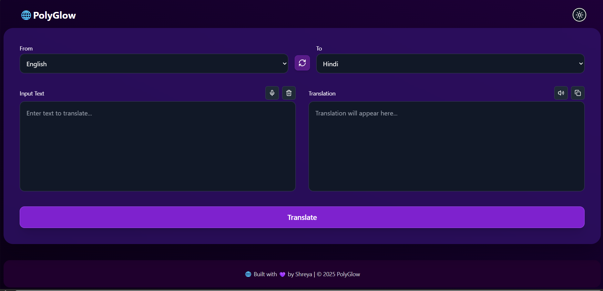
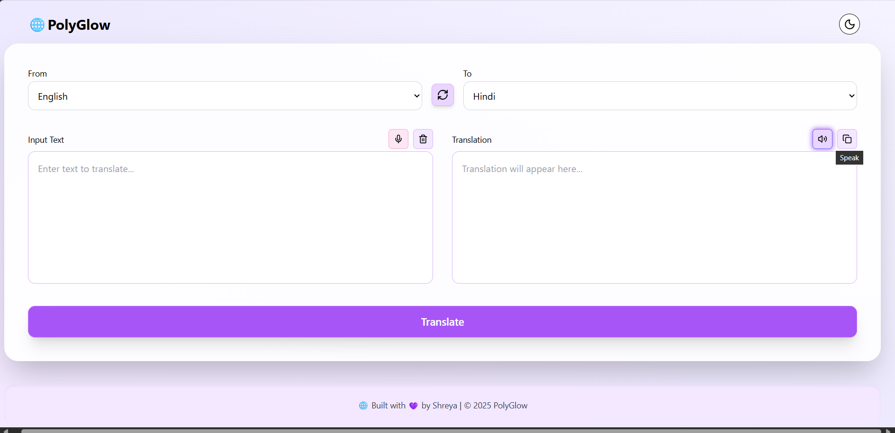
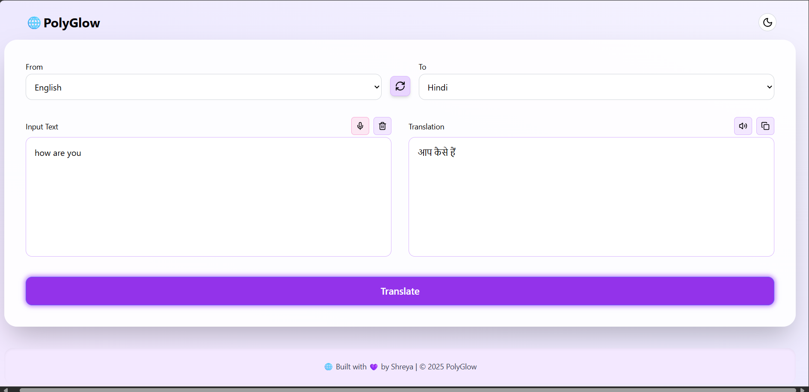

# 🌐 PolyGlow - Multilingual Translator App

PolyGlow is a modern, responsive, and interactive multilingual translator web app that supports text **translation**, **voice input**, and **speech synthesis**. Built with a beautiful UI, animated background particles, and theme toggling, it's designed for ease of use and accessibility.

---

## 📸 Screenshots


<br />

<br />


---

## ✨ Features

- 🔤 Translate text between 35+ global and regional languages
- 🎤 Voice-to-text input using Web Speech API
- 🗣️ Text-to-speech output with native voice support
- 🎨 Light & Dark mode with animated particle background
- 📋 Copy translation to clipboard
- 🔁 Swap source & target languages
- ♻️ Reset/Clear input instantly
- 🔊 Feedback via toast notifications
- 🌈 Styled with Tailwind CSS and glowing hover effects

---

## 🚀 Live Demo

-Live Demo :- https://polyglow.netlify.app/

---

## 🛠️ Tech Stack

| Frontend          | Backend               | APIs Used                      |
|-------------------|-----------------------|--------------------------------|
| Vite + React      | Express + Node.js     | RapidAPI (Deep Translate)      |
| Tailwind CSS      | dotenv, cors, fetch   | Web Speech API (native)        |
| react-hot-toast   |                       | Speech Synthesis / Recognition |

---

## 🧩 Project Structure

```bash
polyglow/
├── client/
│   ├── public/
│   ├── src/
│   │   ├── App.jsx          # Main translator UI
│   │   ├── languages.js     # Language code list
│   │   ├── assets/
│   └── vite.config.js
├── server/
│   ├── index.js             # Express server with /translate route
│   └── .env                 # Contains RAPID_API_KEY
└── README.md

## 📦 Installation & Setup
1. Clone the repository
bash
Copy code
git clone https://github.com/Shreya04-bot/PolyGlow
cd polyglow
2. Setup Backend
bash
Copy code
cd server
npm install
Create a .env file:
🛡️ Copy `.env.example` to `.env` and replace the value with your own:
Copy code
RAPID_API_KEY=your_rapidapi_key_here
Start the server:

bash
Copy code
node index.js
3. Setup Frontend
bash
Copy code
cd ../client
npm install
npm run dev
Frontend runs on: http://localhost:5173
Backend runs on: http://localhost:5000

Make sure your frontend calls /translate or set up a proxy in vite.config.ts.

## 📄 API Endpoint
POST /translate
Translates text using RapidAPI (Deep Translate)

Body:

json
Copy code
{
  "q": "Hello world",
  "source": "en",
  "target": "hi"
}
Response:

json
Copy code
{
  "translatedText": "नमस्ते दुनिया"
}

##🧠 Future Improvements
🌍 Add LibreTranslate as fallback to avoid API limits
📸 OCR-based image translation
🧠 Tone/context-aware translation options
🕘 Translation history with backend storage
🧪 Add tests with Vitest or Jest
📱 PWA support for offline usage
🙋‍♀️ Author
Shreya
👩‍💻 Made with 💜 for language learners and curious minds.

## 📝 License
This project is open-source and available under the MIT License.
